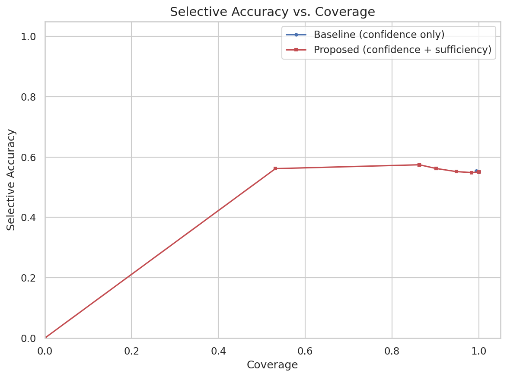
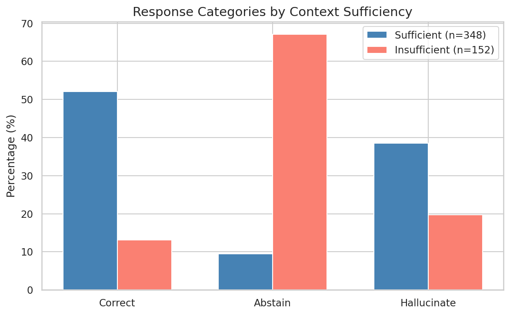

# Baseline Report: RAG Sufficient Context — Selective Generation Pipeline

**GitHub Repository:** https://github.com/SachaYT1/rag-sufficient-context

## 1. Product Name

**RAG Sufficient Context** — a pipeline for explaining and reducing hallucinations in Retrieval-Augmented Generation systems via selective generation, inspired by the ICLR 2025 paper *"Sufficient Context: A New Lens on Systems Retrieval Augmented Generation"*.

## 2. Domain of Application

Reliability and calibration for Retrieval-Augmented Generation (RAG) in open-domain question answering (QA). The pipeline targets any system where an LLM generates answers based on retrieved documents — search engines, customer support bots, knowledge bases, educational assistants, and enterprise QA systems.

## 3. Motivation

Large Language Models integrated into RAG pipelines are increasingly deployed in production. However, a critical failure mode persists: **when retrieved context is insufficient, models tend to hallucinate rather than abstain**. This creates a trust problem — users cannot distinguish confident correct answers from confident hallucinations.

The ICLR 2025 paper by Joren et al. introduces the concept of *sufficient context* as a new diagnostic lens. We are motivated to:
- Reproduce and validate this idea in a practical, university-friendly setting
- Demonstrate that combining a sufficiency signal with model confidence leads to better answer-vs-abstain decisions
- Build a fully reproducible pipeline that others can extend

## 4. Real-World Problem

In real-world RAG deployments:
- **Retrieval is imperfect**: search often returns partially relevant, incomplete, or misleading documents
- **LLMs don't know when to stop**: even strong models (GPT-4, LLaMA-3) frequently generate plausible-sounding but incorrect answers when the context doesn't contain the needed information
- **Consequences are real**: in healthcare, legal, financial, and educational settings, hallucinated answers can cause harm

Our product addresses this by giving the system a mechanism to **recognize when it shouldn't answer** — reducing hallucination rates while maintaining high accuracy on questions it does answer.

## 5. Technical Problem

We frame the technical problem as **selective generation**: given a question Q and retrieved context C, decide whether to answer or abstain.

The challenge decomposes into:

1. **Context sufficiency classification**: Is the retrieved context C sufficient to answer Q? This is a binary classification task on (Q, C) pairs, performed *without access to ground-truth answers*.

2. **Confidence estimation**: How confident is the LLM in its generated answer? We use P(Correct)-style self-reported probability.

3. **Gating decision**: Combine sufficiency and confidence into a single score via logistic regression, and apply a threshold to decide answer vs. abstain.

The key insight from the ICLR 2025 paper is that **confidence alone is insufficient** — a model can be confidently wrong when the context is misleading. Adding the sufficiency signal provides an orthogonal dimension that captures whether the context *supports* any definitive answer.

**Formal setup:**
- Features: x₁ = confidence(Q, C), x₂ = s(Q, C) ∈ {0, 1}
- Gate: g(x₁, x₂) trained via logistic regression
- Decision: if g(x₁, x₂) < τ → abstain; otherwise → answer
- Metric: Selective Accuracy vs. Coverage curves

## 6. Baseline Implementation

### 6.1 Dataset

**HotPotQA** (dev subset, 500 examples) — a multi-hop QA benchmark requiring reasoning over multiple Wikipedia paragraphs. We use the "distractor" setting where each question comes with 10 paragraphs (2 gold + 8 distractors).

### 6.2 Retrieval

- **Method**: BM25 (via `rank_bm25` library) — per-question re-ranking over the HotPotQA distractor set
- **Process**: For each question, we index the 10 provided paragraphs and retrieve the top-5 most relevant
- **Context construction**: Concatenate top-5 passages, truncate to 4096-token budget

### 6.3 Generation

- **Model**: Mistral-7B-Instruct-v0.3 (via HuggingFace Transformers, run on Google Colab T4 GPU)
- **Prompt**: Structured prompt requesting JSON output with answer and confidence score
- **Inference**: Greedy decoding (temperature = 0), max 256 new tokens
- **Runtime**: ~77 minutes for 500 examples on T4 (~9.3s per example)

### 6.4 Evaluation

- **Exact Match (EM)**: Normalized string comparison (lowercase, remove articles/punctuation)
- **F1 Score**: Token-level precision/recall
- **Abstention detection**: Regex whitelist matching phrases like "I don't know", "cannot be determined"
- **Categorization**: Each response is labeled as `correct` (EM=1 or F1≥0.5), `abstain` (matches abstention pattern), or `hallucinate` (neither)

### 6.5 Sufficient Context Autorater

- **Approach**: Use the same Mistral-7B model with a dedicated autorater prompt
- **Chunking**: Split context into chunks of ~1400 tokens
- **Aggregation**: OR-rule — if any chunk is rated as sufficient, the full context is labeled sufficient
- **Runtime**: ~30 minutes for 500 examples on T4 (~3.6s per example)

### 6.6 Selective Generation Gate

- **Baseline**: Threshold on confidence only (x₁)
- **Proposed**: Logistic regression on (confidence, sufficiency) with threshold sweep
- **Evaluation**: Selective Accuracy vs. Coverage curves comparing both approaches (cross-validated predictions to avoid overfitting)

### 6.7 Project Structure

```
rag-sufficient-context/
├── src/
│   ├── retrieval.py      # BM25 retriever + context construction
│   ├── generation.py     # LLM prompting, answer extraction
│   ├── evaluation.py     # EM/F1, abstain detection, categorization
│   ├── autorater.py      # Sufficient context autorater
│   ├── confidence.py     # P(Correct) confidence estimation
│   ├── gate.py           # Logistic regression gate + plotting
│   └── utils.py          # Shared helpers
├── configs/default.yaml  # Hyperparameters
├── notebooks/
│   └── main_pipeline.ipynb  # Colab end-to-end notebook
├── data/                 # Cached results
└── results/              # Outputs, plots, metrics
```

### 6.8 Reproducibility

- Fixed random seed (42) across all experiments
- Cached retrieval results and autorater labels
- Single Colab notebook for end-to-end reproduction
- All dependencies pinned in `requirements.txt`

## 7. Experimental Results

### 7.1 Baseline Generation Performance

| Metric | Value |
|---|---|
| Total examples | 500 |
| Correct | 201 (40.2%) |
| Abstain | 135 (27.0%) |
| Hallucinate | 164 (32.8%) |
| Mean EM | 0.312 |
| Mean F1 | 0.405 |

The model answers correctly in 40.2% of cases, but **hallucinates in 32.8%** — nearly one in three answers is a confident but wrong response. The model abstains in 27.0% of cases.

### 7.2 Context Sufficiency Analysis

The autorater classified **348 out of 500 (69.6%)** contexts as sufficient and **152 (30.4%)** as insufficient.

**Category breakdown by sufficiency:**

| | Abstain | Correct | Hallucinate | Total |
|---|---|---|---|---|
| **Insufficient** | 102 (67.1%) | 20 (13.2%) | 30 (19.7%) | 152 |
| **Sufficient** | 33 (9.5%) | 181 (52.0%) | 134 (38.5%) | 348 |

Key observations:
- **When context is insufficient**, the model mostly abstains (67.1%) — this is the desired behavior
- **When context is sufficient**, the model answers correctly 52.0% of the time, but still hallucinates 38.5%
- Only 13.2% of insufficient-context examples get correct answers (likely by chance or parametric knowledge)
- The sufficiency signal clearly separates high-accuracy vs. high-risk scenarios

### 7.3 Confidence Calibration Problem

| Category | Mean Confidence |
|---|---|
| Correct | 1.000 |
| Hallucinate | 0.998 |
| Abstain | 0.019 |

This reveals a critical finding: **Mistral-7B's self-reported confidence is almost completely uncalibrated**. The model reports near-perfect confidence (0.998–1.000) for both correct answers and hallucinations. Only abstentions receive low confidence. This means confidence alone cannot distinguish correct from hallucinated answers — it can only detect explicit abstentions.

This is precisely the scenario where the sufficient-context signal adds value: it provides an orthogonal dimension that confidence cannot capture.

### 7.4 Selective Generation Gate

The logistic regression gate was trained on 365 examples (excluding abstentions) with two features:

| Feature | Weight |
|---|---|
| Confidence (x₁) | 0.224 |
| Sufficiency (x₂) | **0.645** |
| Intercept | -0.577 |

The **sufficiency weight (0.645) is nearly 3x the confidence weight (0.224)**, confirming that the sufficiency signal carries more predictive power for distinguishing correct from hallucinated answers. This is consistent with the confidence calibration problem — since confidence is nearly identical for correct and hallucinated answers, the gate relies primarily on the sufficiency signal.

### 7.5 Selective Accuracy vs. Coverage Curves



The accuracy-coverage plot shows that the baseline (confidence only) and the proposed method (confidence + sufficiency) produce **nearly overlapping curves**. Both achieve ~55% selective accuracy at full coverage, rising to ~58% at ~85% coverage.

**Analysis of why the curves overlap:**

The near-identical curves are explained by the confidence calibration problem (Section 7.3). Since confidence is binary (≈0 for abstentions, ≈1 for everything else), sweeping a confidence threshold produces only two operating points: either include all non-abstain examples (coverage ≈73%, accuracy ≈55%) or include nothing. The gate, despite having a better sufficiency signal, operates on the same near-binary confidence landscape and cannot leverage it for fine-grained thresholding.

This is a meaningful negative result: **P(Correct)-style self-reported confidence from Mistral-7B is too poorly calibrated to enable effective selective generation via threshold sweeping**. The gate's positive sufficiency weight (0.645) shows the signal is informative, but its utility is bottlenecked by the confidence feature's lack of granularity.

### 7.6 Sufficiency Breakdown Visualization



The bar chart clearly shows the diagnostic value of the sufficiency signal:
- **Sufficient contexts**: 52% correct, 9.5% abstain, 38.5% hallucinate
- **Insufficient contexts**: 13% correct, 67% abstain, 20% hallucinate

The sufficiency label alone shifts the distribution dramatically — from majority-correct to majority-abstain — validating the ICLR 2025 paper's core claim that context sufficiency is a powerful lens for understanding RAG behavior.

## 8. Contribution of Each Groupmate

| Team Member | Role | Contribution |
|---|---|---|
| **Aleksandr Gavkovskii** | Project Lead | End-to-end project architecture and repo setup; retrieval pipeline (`retrieval.py`); generation module (`generation.py`); evaluation framework (`evaluation.py`); sufficient context autorater (`autorater.py`); shared utilities and LLM inference abstraction (`utils.py`); integration of all modules; Colab notebook development and experiment execution; baseline report writing and results analysis; code review of all components |
| **Ilya Maksimov** | Confidence & Prompting | Confidence estimation module (`confidence.py`); prompt engineering and tuning for QA and autorater prompts; testing and debugging on Colab |
| **Karim Zakirov** | Gate & Visualization | Selective generation gate (`gate.py`); visualization and plotting (accuracy-coverage curves, sufficiency breakdown charts); manual labeling coordination |

## 9. Lessons Learned

1. **Confidence calibration is the bottleneck**: The most striking result is that Mistral-7B's P(Correct) self-reported confidence is nearly useless for distinguishing correct from hallucinated answers (both ≈1.0). This makes the selective generation gate's threshold sweep ineffective, as there is no gradient to sweep over. Future work must address this with better confidence estimation methods (e.g., P(True) self-consistency, token-level entropy).

2. **Sufficiency signal is genuinely informative**: Despite the confidence calibration failure, the sufficiency autorater successfully separates high-risk from low-risk scenarios. When context is insufficient, the hallucination rate drops from 38.5% to 19.7%, and the abstention rate rises from 9.5% to 67.1%. The gate's learned weight confirms this: sufficiency weight (0.645) is 3x the confidence weight (0.224).

3. **Prompt engineering is critical**: Small changes in how we prompt the LLM for JSON output significantly affect parsing reliability. Constrained output formats need careful iteration.

4. **BM25 is a strong baseline**: Despite being a simple lexical method, BM25 performs surprisingly well on HotPotQA's distractor setting, where the candidate set is small (10 passages).

5. **Modular design pays off**: Splitting the pipeline into independent modules (retrieval, generation, evaluation, autorater, gate) made parallel development across three team members smooth.

6. **Reproducibility requires discipline**: Caching intermediate results (retrieval, generation, autorater) was essential — the full pipeline takes ~2 hours on Colab T4. Without caching, restarted sessions would need to re-run everything.

## 10. Further Goals

### Technical Goals (Next Steps)

- **Fix the confidence bottleneck**: Implement P(True) self-consistency (generate N sampled answers, compute agreement) as a replacement for P(Correct). This should produce a more granular confidence signal that enables meaningful threshold sweeping.
- **Token-level entropy**: Extract per-token log-probabilities during generation and use entropy as an alternative confidence signal — this avoids relying on self-reported probabilities entirely.
- **Dense retrieval comparison**: Add e5-base-v2 as an alternative retriever and compare with BM25.
- **Second dataset**: Evaluate on MuSiQue to test generalization beyond HotPotQA.
- **Ablation studies**: Vary chunk size (800–2000 tokens), context budget (2k–8k tokens), and top-k (3–10).
- **Autorater validation**: Complete manual labeling of 80–150 examples and estimate autorater accuracy.
- **LLM-based evaluator**: Add a separate LLM judge for answer quality beyond EM/F1 (to catch partial-credit answers that EM misses).
